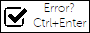
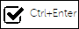
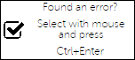

# Setting the logo button

To ensure that users began to point out an error in the text, they have to find
out information about this feature. It is proposed to add to the site logo that
tells users the possibility to point out errors. This logo is most often added
to the footer of the page or in the title of the article.

This bundle is possible to build such a logo, which is needed for your website.
By default logo has a 88x31 size and looks like this:



This logo can be added as follows:
```twig

```

There are 4 different logos - with a single line of text, with two and three
lines, as well as empty (you can fill by hand). You can also configure some
settings of the logo:

Parameter         | Default value *             | Description
------------------|-----------------------------|----------------------
width             | 88px                        | Width of logo
height            | 31px                        | Height of logo
text_top          | Error?                      | Text of top line
text_center       | Select with mouse and press | Text of middle line
text_bottom       | Ctrl+Enter                  | Text of bottom line
parent_class      |                             | Class of root element
text_class        |                             | Class of all lines
text_class_top    |                             | Class of top line
text_class_center |                             | Class of middle line
text_class_bottom |                             | Class of bottom line

_*_ default lines of text is taken from translation file `LexxpavlovSpellingBundle`.

Examples of logo:
```twig



```
<br>
<br>


> Icon is from [fontawesome](http://fontawesome.io/icon/check-square-o/) `fa-check-square-o`<br>
> In the bundle icon is used in picture:<br>
> 
 