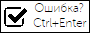

# Настройка логотипа

Чтобы пользователи начали указывать ошибки в текстах, они должны узнать 
информацию об этой возможности. Предлагается добавить на сайт логотип, который
подскажет пользователям о возможности указать ошибки. Подобный логотип чаще 
всего добавлят в футер страницы или в заголовок статьи.

В этом бандле существует возможность построить логотип таким, какой нужен для 
вашего сайта. По умолчанию логотип имеет размер 88х31 и выглядит так:



Такой логотип можно добавить следующим образом:
```twig

```

Существует 4 разных логотипа - с одной строкой текста, с двумя и тремя
строками, а также пустой (можете наполнить вручную). Также можно настроить
некоторые настройки логотипа:

Параметр          | Значение по умолчанию *          | Описание
------------------|----------------------------------|----------------------------
width             | 88px                             | Ширина логотипа
height            | 31px                             | Высота логотипа
text_top          | Ошибка?                          | Текст верхней строки текста
text_center       | Выделите ошибку мышкой и нажмите | Текст средней строки текста
text_bottom       | Ctrl+Enter                       | Текст нижней строки текста
parent_class      |                                  | Класс корневого элемента
text_class        |                                  | Класс всех строк текста
text_class_top    |                                  | Класс верхней строки текста
text_class_center |                                  | Класс средней строки текста
text_class_bottom |                                  | Класс нижней строки текста

_*_ текст строк по умолчанию берётся из файла переводов `LexxpavlovSpellingBundle`.

Примеры логотипов:
```twig



```
<br>
<br>


> Иконка из шрифта [fontawesome](http://fontawesome.io/icon/check-square-o/) `fa-check-square-o`<br>
> В бандле используется иконка в картинке:<br>
> 
 